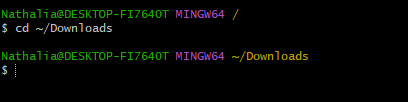
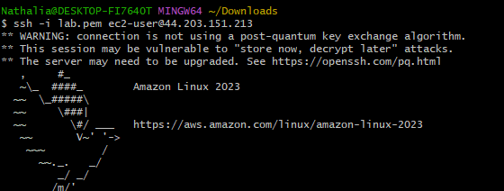
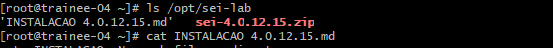
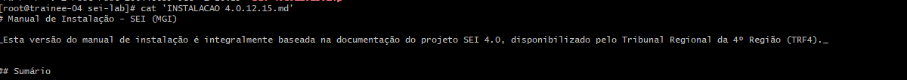
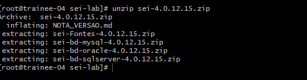
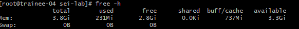

## Laboratório SEI/SIP — Orientações aos trainees
Cada trainee terá acesso a uma instância EC2 exclusiva para configurar um ambiente completo do SEI/SIP.
O prazo para conclusão é de 2 semanas.

## Objetivo

Preparar o ambiente completo do SEI/SIP seguindo o manual de instalação disponível em:

Atividades
Na sua EC2, configure:
- servidor web Apache/PHP para disponibilizar o SEI e o SIP;
- banco de dados e restauração das bases;
- servidor Solr para indexação e pesquisa;
- servidor Memcached para cache e permissões;
- estrutura de diretórios, permissões e configurações do SEI/SIP;
- comunicação entre os serviços;
- acesso ao sistema via navegador usando HTTP/HTTPS.
Resultado esperado
Ao final do laboratório:
- o SEI e o SIP devem estar acessíveis pelo navegador;
- o login deve funcionar;
- o banco deve estar conectado corretamente;
- o Memcached deve estar operacional;
- o Solr deve responder às pesquisas;
- os arquivos e permissões devem seguir o manual;
- o trainee deve conseguir explicar a função de cada serviço e as principais configurações realizadas.
Utilize somente a sua instância e não altere os ambientes dos demais trainees. Ao final, apresente o endereço de acesso, os serviços configurados e um breve resumo das etapas realizadas.

chave ssh mesma dos outros labs! ssh liberado para rede da positivo

### Resolução
Neste desafio em específico foi utilizado o git bash

Passo 1 - Entrar na pasta onde o lab.pem está
```bash
cd ~/Downloads
```


Passo 2 - Realizar a conexão SSH utilizando a chave contida no lab.pem
```bash
ssh -i lab.pem ec2-user@44.203.151.213
```


Passo 3 - Acessar no modo root para ter acesso aos arquivos da documentação
```bash
sudo -i
```


Passo 4 - Verificar arquivos
```bash
ls /opt/sei-lab
```


Passo 5 - Acessar documentação
```bash
cat 'INSTALACAO 4.0.12.15.md'
```


Passo 6 - Descompactar arquivos
```bash
unzip sei-4.0.12.15.zip
```


Passo 7 - 
```bash

```

