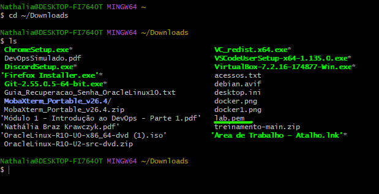

## Objetivo

Você recebeu acesso a um ambiente Linux que executa uma aplicação web simples. A aplicação possui três camadas:

- uma interface web;
- uma API responsável pela lógica da aplicação;
- um banco de dados que armazena os dados exibidos.

O ambiente foi preparado com uma falha controlada. Sua missão é investigar o estado da aplicação, identificar a causa raiz e reativar o fluxo completo para que a página volte a funcionar.

## Resultado esperado

Ao concluir o laboratório:

- a aplicação estará acessível pelo endereço recebido;
- a interface conseguirá consultar e exibir os dados do banco;
- os serviços necessários estarão funcionando;
- você conseguirá explicar em qual camada estava o problema e por que a correção resolveu o incidente.

## O que será avaliado

A avaliação considera a capacidade de raciocinar sobre uma aplicação distribuída em camadas, distinguir sintoma de causa, validar a recuperação e comunicar claramente o diagnóstico realizado.

O ambiente é exclusivamente para treinamento. Não altere configurações de outros trainees e não compartilhe a chave de acesso recebida.

# Resolução
Neste desafio em específico foi utilizado o git bash

### Passo 1 — Localizar o arquivo lab.pem
```bash
cd ~/Downloads
```
```bash
ls
```


### Passo 2 — Proteger a sua chave privada (o arquivo lab.pem), garantindo que apenas você possa ler o arquivo e ninguém mais no sistema tenha acesso a ele.
```bash
chmod 400 lab.pem
```

### Passo 3 - Conectar na máquina
```bash
ssh -i lab.pem ubuntu@54.167.237.81
```

### Passo 4 - Testar no navegador
```bash
http://ec2-54-167-237-81.compute-1.amazonaws.com/
```

Obs: realizei o teste utilizando o ip 54.167.237.81 porém aparecia um bloqueio, sendo assim testei com o dns: ec2-54-167-237-81.compute-1.amazonaws.com e a aplicação subiu como o esperado


Erro observado na página: "Falha ao consultar a aplicação
Unexpected token '<'"

Aqui começa o troubleshooting de forma organizada, realização de testes 
### Passo 5 - Confirmar o usuário
```bash
whoami
```

### Passo 6 - Verificar a máquina
```bash
hostname
cat /etc/os-release
```

### Passo 7 - Verificar as portas abertas
```bash
sudo ss -lntp
```

### Passo 8 - Verificar o Nginx
```bash
sudo systemctl status nginx --no-pager
```

### Passo 9 - Testar o Nginx localmente
```bash
curl -I http://localhost
```
e

```bash
curl http://localhost
```
### Passo 10 - Verificar o Node.js
```bash
ps aux | grep node
```
e

```bash
pgrep -a node
```

### Passo 11 - Verificar o PostgreSQL
```bash
sudo systemctl status postgresql --no-pager
```
e

```bash
sudo ss -lntp | grep 5432
```

### Passo 12 - Descobrir como o Nginx está encaminhando a API
```bash
sudo nginx -T 2>&1 | grep -E "location|proxy_pass|root"
```

Após esses comandos é possível verificar que:
o Nginx está funcionando ✅
Camada Web/Nginx está funcionando ✅
PostgreSQL está funcionando ✅
A API Node.js é a principal suspeita ⚠️ - Após o comando ps aux | grep node não apareceu nenhum processo Node.js.

### Passo 13 - verificar o que acontece quando tentamos acessar a API diretamente.
```bash
curl -i http://127.0.0.1:3000
```
Evidência muito forte de que não existe serviço escutando na porta 3000 no back-end.

### Passo 14 - Testar o endpoint que o Front-end usa:
```bash
curl -i http://127.0.0.1:3000/api/items
```
### Passo 15 - Testar através do próprio Nginx:
```bash
curl -i http://localhost/api/items
```

### Passo 16 - Testar Node.js
```bash
curl -i http://127.0.0.1:3000
```

### Passo 17 - Testar diretamente o endpoint
```bash
curl -i http://127.0.0.1:3000/api/items
```

### Passo 18 - Testar pelo Nginx
```bash
curl -i http://localhost/api/items
```
É possível observar que
127.0.0.1:3000 - não existe nenhum serviço aceitando conexão.
/api/items pelo Nginx retornou 404, então é necessário verificar o bloco de configuração correto.
Nginx está funcionando.
PostgreSQL está funcionando.

### Passo 19 - Procurar o serviço da API
```bash
systemctl list-units --type=service --all | grep -Ei 'node|api|app'
```
e

```bash
systemctl list-unit-files --type=service | grep -Ei 'node|api|app'
```
e

```bash
systemctl --failed
```

Foi possível verificar que a API existe como serviço, está habilitada para iniciar automaticamente, mas está tentando iniciar e falhando, entrando em um ciclo de reinicialização automática.

Isso explica perfeitamente por que a porta 3000 não está aberta.

### Passo 20 - Ver o status detalhado da API
```bash
sudo systemctl status training-api.service --no-pager
```
e

```bash
sudo journalctl -u training-api.service --no-pager -n 50
```
O serviço está tentando executar:
/usr/bin/node /opt/training-api/server.js
mas o usuário que executa o serviço não tem permissão para acessar/ler o arquivo server.js.

### Passo 21 - Ver o status detalhado da API
```bash
sudo systemctl status training-api.service --no-pager
```

### Passo 22 - Descobrir exatamente quais são as permissões atuais e qual usuário o serviço utiliza

Qual usuário o serviço training-api utiliza
```bash
sudo systemctl cat training-api.service
```

Quem é o dono do server.js
```bash
ls -l /opt/training-api/server.js
```

Quais são as permissões da pasta /opt/training-api
```bash
ls -ld /opt/training-api
```

### Passo 23 - Descobrir exatamente quais são as permissões atuais e qual usuário o serviço utiliza

Qual usuário o serviço training-api utiliza
```bash
sudo systemctl cat training-api.service
```
O serviço executa a API com: User=training-api

Mas o arquivo está assim: -rw------- 1 root root 1920 /opt/training-api/server.js

Isso significa que o root é o dono do arquivo.
O grupo também é root.
-rw------- significa que somente o root pode ler e escrever.
O usuário training-api não consegue nem ler o server.js.

A pasta, por outro lado, está correta: drwxr-xr-x 2 training-api training-api /opt/training-api

Causa raiz

O arquivo /opt/training-api/server.js está com proprietário root:root e permissão 600, impedindo o usuário training-api, definido no serviço systemd, de ler o arquivo.

Isso explica o EACCES e a API não conseguir iniciar.

### Passo 24 -Como a aplicação deve ser executada pelo usuário training-api, o mais adequado é alterar o proprietário do arquivo para esse usuário.

```bash
sudo chown training-api:training-api /opt/training-api/server.js
```
```bash
ls -l /opt/training-api/server.js
```

### Passo 25 - Reiniciar a API
```bash
sudo systemctl restart training-api.service
```
```bash
sudo systemctl status training-api.service --no-pager
```
### Passo 26 - Testar a API
```bash
curl -i http://127.0.0.1:3000/health
```
```bash
curl -i http://127.0.0.1:3000/api/items
```
### Passo 27 - Verificar o status da API
```bash
sudo systemctl status training-api.service --no-pager
```
e

```bash
sudo journalctl -u training-api.service --no-pager -n 30
```

### Passo 28 - Verificar se a correção funcionou
```bash
sudo systemctl restart training-api.service
```
e

```bash
sudo systemctl status training-api.service --no-pager
```
