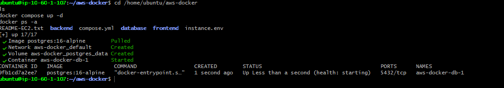
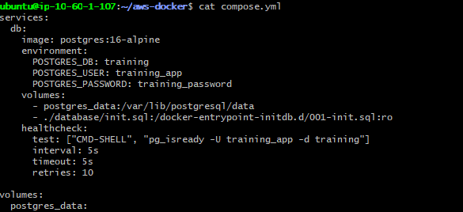
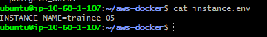
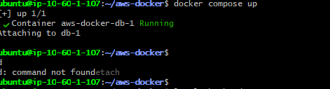
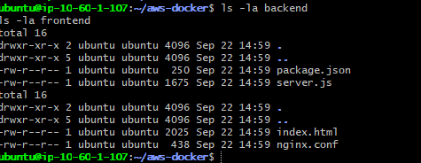

## Objetivo

Você recebeu acesso a um ambiente Linux que executa uma aplicação web simples. A aplicação possui três camadas:

- uma interface web;
- uma API responsável pela lógica da aplicação;
- um banco de dados que armazena os dados exibidos.

O ambiente foi preparado com uma falha controlada. Sua missão é investigar o estado da aplicação, identificar a causa raiz e reativar o fluxo completo para que a página volte a funcionar.

## Resultado esperado

Ao concluir o laboratório:

- a aplicação estará acessível pelo endereço recebido;
- a interface conseguirá consultar e exibir os dados do banco;
- os serviços necessários estarão funcionando;
- você conseguirá explicar em qual camada estava o problema e por que a correção resolveu o incidente.

## O que será avaliado

A avaliação considera a capacidade de raciocinar sobre uma aplicação distribuída em camadas, distinguir sintoma de causa, validar a recuperação e comunicar claramente o diagnóstico realizado.

O ambiente é exclusivamente para treinamento. Não altere configurações de outros trainees e não compartilhe a chave de acesso recebida.

# Resolução
Neste desafio em específico foi utilizado o git bash

### Passo 1 — Localizar o arquivo lab.pem
```bash
cd ~/Downloads
```

```bash
ls
```


### Passo 2 — Proteger a sua chave privada (o arquivo lab.pem), garantindo que apenas você possa ler o arquivo e ninguém mais no sistema tenha acesso a ele.
```bash
chmod 400 lab.pem
```

### Passo 3 — Conectar na máquina Linux
```bash
ssh -i lab.pem ubuntu@32.193.247.226
```

### Passo 4 — Testar no navegador
```bash
http://ec2-32-193-247-226.compute-1.amazonaws.com/
```


Aqui começa o troubleshooting de forma organizada, realização de testes
### Passo 5 — Verificar se o docker está rodando
```bash
sudo systemctl status docker
```

### Passo 6 — Verificar conteiners docker
```bash
cd /home/ubuntu/aws-docker
```


Problema encontrado: 
o Docker nem está instalado na instância. Por isso não há nada escutando na porta 80 e o navegador recebe ERR_CONNECTION_RESET — o SO aceita a conexão TCP, mas não existe processo nenhum para responder.
### Passo 7 — Confirmar que o pacote docker não existe
```bash
sudo systemctl status docker
```

```bash
 cd /home/ubuntu/aws-docker
```

```bash
which docker
docker --version
```

### Passo 8 — Instalar o Docker Engine (Ubuntu 24.04)
```bash
# Remove pacotes conflitantes antigos, se existirem
sudo apt-get remove -y docker docker-engine docker.io containerd runc 2>/dev/null

# Atualiza índices
sudo apt-get update

# Dependências
sudo apt-get install -y ca-certificates curl gnupg

# Chave GPG oficial do Docker
sudo install -m 0755 -d /etc/apt/keyrings
sudo curl -fsSL https://download.docker.com/linux/ubuntu/gpg -o /etc/apt/keyrings/docker.asc
sudo chmod a+r /etc/apt/keyrings/docker.asc

# Repositório
echo \
  "deb [arch=$(dpkg --print-architecture) signed-by=/etc/apt/keyrings/docker.asc] https://download.docker.com/linux/ubuntu \
  $(. /etc/os-release && echo "$VERSION_CODENAME") stable" | \
  sudo tee /etc/apt/sources.list.d/docker.list > /dev/null

sudo apt-get update

# Instala Docker + Compose plugin
sudo apt-get install -y docker-ce docker-ce-cli containerd.io docker-buildx-plugin docker-compose-plugin
```
### Passo 9 — Habilitar e iniciar o docker
```bash
sudo systemctl enable --now docker
sudo systemctl status docker
```

### Passo 10 — Verificar instalação
```bash
docker --version
```

### Passo 11 — Rodar docker sem sudo
```bash
sudo usermod -aG docker $USER
```

### Passo 12 — Fazer com que o grupo docker seja aplicado à sessão atual do terminal para que a permissão de sudo seja aplicada sem precisar reiniciar o acesso ssh.
```bash
newgrp docker
```
```bash
docker ps -a
```

### Passo 13 — Subir a aplicação de novo
```bash
cd /home/ubuntu/aws-docker
ls
docker compose up -d
docker ps -a
```


É possível observar que apenas o container do banco (db) subiu. O backend e o frontend não aparecem nem tentaram subir, o que sugere que algo no compose.yml está impedindo o build/start deles (imagem não definida corretamente, erro de build, ou até um profile/condição que os exclui).
### Passo 14 — Verificar o compose.yml completo
```bash
cat compose.yml
```

O compose.yml só define o serviço db. Não existe backend nem frontend declarados no arquivo, por isso o Docker nunca tentou subir essas camadas. Não é um erro de configuração (variável errada, porta errada), é uma falta completa dos serviços no compose.

Isso já explica todo o sintoma: sem backend e frontend, nada escuta na porta 80, e o navegador recebe ERR_CONNECTION_RESET.

### Passo 15 — Verificar o instance.env
```bash
cat instance.env
```

### Passo 16 — Tentar subir de novo, mas olhando o output completo
```bash
docker compose up
```

### Passo 17 — Conferir se existe Dockerfile nas pastas backend/frontend
```bash
ls -la backend
ls -la frontend
```

