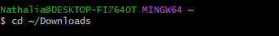
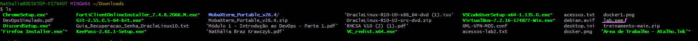
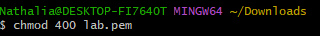
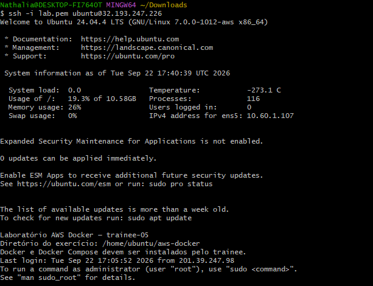

## Objetivo

Você recebeu acesso a um ambiente Linux que executa uma aplicação web simples. A aplicação possui três camadas:

- uma interface web;
- uma API responsável pela lógica da aplicação;
- um banco de dados que armazena os dados exibidos.

O ambiente foi preparado com uma falha controlada. Sua missão é investigar o estado da aplicação, identificar a causa raiz e reativar o fluxo completo para que a página volte a funcionar.

## Resultado esperado

Ao concluir o laboratório:

- a aplicação estará acessível pelo endereço recebido;
- a interface conseguirá consultar e exibir os dados do banco;
- os serviços necessários estarão funcionando;
- você conseguirá explicar em qual camada estava o problema e por que a correção resolveu o incidente.

## O que será avaliado

A avaliação considera a capacidade de raciocinar sobre uma aplicação distribuída em camadas, distinguir sintoma de causa, validar a recuperação e comunicar claramente o diagnóstico realizado.

O ambiente é exclusivamente para treinamento. Não altere configurações de outros trainees e não compartilhe a chave de acesso recebida.

# Resolução
Neste desafio em específico foi utilizado o git bash

### Passo 1 — Localizar o arquivo lab.pem
```bash
cd ~/Downloads
```

```bash
ls
```


### Passo 2 — Proteger a sua chave privada (o arquivo lab.pem), garantindo que apenas você possa ler o arquivo e ninguém mais no sistema tenha acesso a ele.
```bash
chmod 400 lab.pem
```

### Passo 3 — Conectar na máquina Linux
```bash
ssh -i lab.pem ubuntu@32.193.247.226
```

### Passo 4 —
```bash

```

### Passo 5 —
```bash

```

### Passo 6 —
```bash

```

### Passo 7 —
```bash

```

### Passo 8 —
```bash

```

### Passo 9 —
```bash

```

### Passo 10 —
```bash

```

