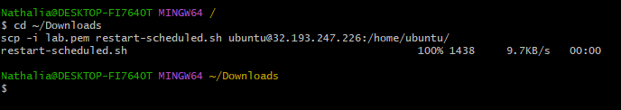
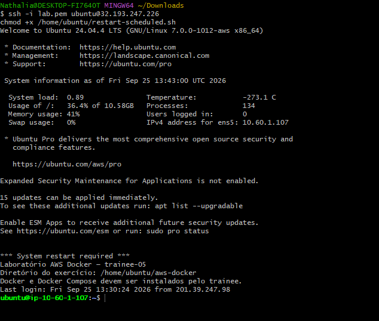
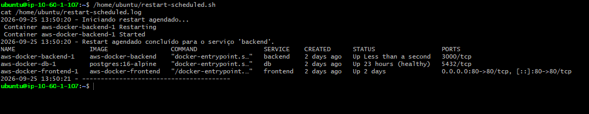

## Objetivo

Você recebeu acesso a um ambiente Linux que executa uma aplicação web simples. A aplicação possui três camadas:

- uma interface web;
- uma API responsável pela lógica da aplicação;
- um banco de dados que armazena os dados exibidos.

O ambiente foi preparado com uma falha controlada. Sua missão é investigar o estado da aplicação, identificar a causa raiz e reativar o fluxo completo para que a página volte a funcionar.

## Resultado esperado

Ao concluir o laboratório:

- a aplicação estará acessível pelo endereço recebido;
- a interface conseguirá consultar e exibir os dados do banco;
- os serviços necessários estarão funcionando;
- você conseguirá explicar em qual camada estava o problema e por que a correção resolveu o incidente.

## O que será avaliado

A avaliação considera a capacidade de raciocinar sobre uma aplicação distribuída em camadas, distinguir sintoma de causa, validar a recuperação e comunicar claramente o diagnóstico realizado.

O ambiente é exclusivamente para treinamento. Não altere configurações de outros trainees e não compartilhe a chave de acesso recebida.


## Problema do laboratório - Crie um agendamento pra restartar o serviço do docker e gravar um log do horário que foi restartado o container, utilize a mesma vm do lab 2

### Resolução
Neste desafio em específico foi utilizado o git bash

### Destrinchando o script

```bash
#!/bin/bash
#
# restart-scheduled.sh
# Reinicia os containers da aplicação (Docker Compose) em um horário agendado
# e registra no log a data/hora exata em que o restart aconteceu.
#
# Diferença em relação ao monitor-php.sh:
#   - monitor-php.sh reinicia SOMENTE quando detecta falha (reativo)
#   - restart-scheduled.sh reinicia SEMPRE, no horário definido pelo cron (preventivo/agendado)

# ==== CONFIGURAÇÕES (ajuste conforme seu projeto) ====

# Pasta onde está o compose.yml da aplicação
APP_DIR="/home/ubuntu/aws-docker"

# Nome do serviço a ser reiniciado (ex: "backend", "db", "frontend")
# Deixe em branco ("") para reiniciar TODOS os serviços do compose.yml
SERVICE_NAME="backend"

# Arquivo de log
LOG_FILE="/home/ubuntu/restart-scheduled.log"

# ==== FUNÇÃO DE LOG ====
log() {
  echo "$(date '+%Y-%m-%d %H:%M:%S') - $1" >> "$LOG_FILE"
}

# ==== EXECUÇÃO ====
cd "$APP_DIR" || { log "ERRO: não foi possível acessar $APP_DIR"; exit 1; }

log "Iniciando restart agendado..."

if [ -z "$SERVICE_NAME" ]; then
  docker compose restart >> "$LOG_FILE" 2>&1
  log "Restart agendado concluído para TODOS os serviços."
else
  docker compose restart "$SERVICE_NAME" >> "$LOG_FILE" 2>&1
  log "Restart agendado concluído para o serviço '$SERVICE_NAME'."
fi

# Registra o status atual dos containers logo após o restart
docker compose ps >> "$LOG_FILE" 2>&1
log "----------------------------------------"

exit 0

```
#### Bloco de configurações
```bash
bash
* APP_DIR="/home/ubuntu/aws-docker"
* SERVICE_NAME=""
* LOG_FILE="/home/ubuntu/restart-scheduled.log"
```
Essas três variáveis são os "ajustes" do script, os únicos pontos que são necessários para adaptar a outro projeto:

APP_DIR: onde está o compose.yml. O script precisa entrar nessa pasta antes de rodar qualquer comando docker compose, senão ele não encontra a configuração (foi o erro no configuration file provided que você teve antes).
SERVICE_NAME: qual serviço reiniciar. Está vazio ("") de propósito, para reiniciar todos os containers (db, backend, frontend) de uma vez, em vez de só um.
LOG_FILE: caminho do arquivo onde tudo vai ser registrado.

#### Função de log

```bash
log() {
  echo "$(date '+%Y-%m-%d %H:%M:%S') - $1" >> "$LOG_FILE"
}
```
Isso cria uma "mini-função" chamada log, para não repetir código toda vez que precisar escrever no log. Ela funciona assim:

* date '+%Y-%m-%d %H:%M:%S' → pega a data e hora atual, formatada como 2026-09-24 15:00:01
* $1 → é o texto necessário para passar para a função (o primeiro argumento)
* >> "$LOG_FILE" → adiciona a linha no final do arquivo de log, sem apagar o que já tinha antes

Assim, sempre que o script chama log "alguma mensagem", ele escreve data/hora - alguma mensagem no arquivo.

#### Entrar na pasta do projeto

```bash
cd "$APP_DIR" || { log "ERRO: não foi possível acessar $APP_DIR"; exit 1; }
```

Isso tenta entrar na pasta definida em APP_DIR. O || significa "ou, se isso falhar, faça o seguinte", ou seja, se a pasta não existir ou não puder ser acessada, o script registra um erro no log e encerra imediatamente (exit 1), sem tentar continuar (o que evitaria, por exemplo, rodar docker compose restart na pasta errada).

#### Registrar o início do processo

```bash
log "Iniciando restart agendado..."
```

Marca no log o momento exato em que o script começou a rodar. Isso é importante para que seja possível calcular quanto tempo o restart levou (comparando com o log de "concluído" mais adiante).

#### A decisão: reiniciar tudo ou só um serviço?

```bash
if [ -z "$SERVICE_NAME" ]; then
  docker compose restart >> "$LOG_FILE" 2>&1
  log "Restart agendado concluído para TODOS os serviços."
else
  docker compose restart "$SERVICE_NAME" >> "$LOG_FILE" 2>&1
  log "Restart agendado concluído para o serviço '$SERVICE_NAME'."
fi
```
Isso é um if/else:

* [ -z "$SERVICE_NAME" ] → testa se a variável SERVICE_NAME está vazia (-z significa "zero length", ou seja, "está vazia?")
* Se estiver vazia: roda docker compose restart sem especificar nenhum nome, isso reinicia todos os serviços do compose.yml
* Se não estiver vazia (ex: SERVICE_NAME="backend"): roda docker compose restart backend, reinicia só aquele serviço

O >> "$LOG_FILE" 2>&1 no final de cada comando faz duas coisas:

* >> → joga a saída normal do comando (o que apareceria na tela) para dentro do log
* 2>&1 → joga também as mensagens de erro (se houver) para o mesmo lugar, junto com a saída normal

Assim, qualquer coisa que o docker compose restart "diria" na tela fica registrada no arquivo, não perdida.

#### Registrar o status depois do restart

```bash
docker compose ps >> "$LOG_FILE" 2>&1
log "----------------------------------------"
```
Depois de reiniciar, o script roda docker compose ps (lista os containers e seus status) e joga esse resultado direto no log, assim não é preciso confiar apenas na palavra "concluído", tem a prova visual de que os containers realmente subiram (Up) logo em seguida.

A linha de traços (----) é só um separador visual, que consiga identificar onde termina uma execução e começa a próxima quando o log crescer com o tempo (já que o cron vai rodar isso de hora em hora).

#### Encerrar o script
```bash
exit 0
```

Isso diz ao sistema "o script terminou com sucesso" (o código 0 é a convenção universal em Linux para "sem erros"). Isso é usado principalmente pelo cron, que registra internamente se cada execução teve sucesso (0) ou falha (qualquer outro número).

### Utilizando o script na prática 

### Passo 1 — Teanferir o script para a VM
```bash
cd ~/Downloads
scp -i lab.pem restart-scheduled.sh ubuntu@32.193.247.226:/home/ubuntu/
```


### Passo 2 — Conectar na VM e dar permissão de execução
```bash
ssh -i lab.pem ubuntu@32.193.247.226
chmod +x /home/ubuntu/restart-scheduled.sh
```


### Passo 3 — Testar manualmente
```bash
/home/ubuntu/restart-scheduled.sh
cat /home/ubuntu/restart-scheduled.log
```



### Passo 4 — Definindo parâmetros via cron
Agendar via cron

Escolha a frequência. Alguns exemplos:

A cada 1 hora:
```bash
(crontab -l 2>/dev/null; echo "0 * * * * /home/ubuntu/restart-scheduled.sh") | crontab -
```


#### Resumo do fluxo completo
1. Entra na pasta do projeto (ou para com erro se não conseguir)
2. Registra "iniciando" no log
3. Decide: reinicia tudo ou só um serviço específico
4. Executa o docker compose restart, salvando toda a saída no log
5. Registra "concluído" no log
6. Salva o status atual dos containers no log
7. Adiciona uma linha separadora
8. Termina

