## Objetivo

Você recebeu acesso a um ambiente Linux que executa uma aplicação web simples. A aplicação possui três camadas:

- uma interface web;
- uma API responsável pela lógica da aplicação;
- um banco de dados que armazena os dados exibidos.

O ambiente foi preparado com uma falha controlada. Sua missão é investigar o estado da aplicação, identificar a causa raiz e reativar o fluxo completo para que a página volte a funcionar.

## Resultado esperado

Ao concluir o laboratório:

- a aplicação estará acessível pelo endereço recebido;
- a interface conseguirá consultar e exibir os dados do banco;
- os serviços necessários estarão funcionando;
- você conseguirá explicar em qual camada estava o problema e por que a correção resolveu o incidente.

## O que será avaliado

A avaliação considera a capacidade de raciocinar sobre uma aplicação distribuída em camadas, distinguir sintoma de causa, validar a recuperação e comunicar claramente o diagnóstico realizado.

O ambiente é exclusivamente para treinamento. Não altere configurações de outros trainees e não compartilhe a chave de acesso recebida.


## Problema do laboratório - Crie um script para automatizar a resolução caso alguma aplicação php caia utilizando a mesma vm do desafio 2

### Resolução
Neste desafio em específico foi utilizado o git bash

### Passo a passo do script

### Passo 1 — Verificar se o container do PHP existe e está de pé
```bash
CONTAINER_STATUS=$(docker compose ps --status running --services 2>/dev/null | grep -w "$SERVICE_NAME")
```
Isso pergunta ao Docker: "o serviço php está na lista de containers rodando?". Se não estiver (caiu, travou, foi encerrado), essa variável fica vazia.

### Passo 2 — Mesmo rodando, ele está respondendo?
```bash
HTTP_CODE=$(curl -s -o /dev/null -w "%{http_code}" --max-time 5 "$HEALTH_URL")
```
Aqui o script faz uma requisição real, como se fosse um navegador acessando /health. Se a resposta for 200, está tudo bem. Se vier qualquer outro código (ou nada, tipo timeout), significa que o processo até está de pé, mas travado ou quebrado por dentro, coisa que o docker ps sozinho não detectaria.

Por que as duas checagens? Porque só olhar "container rodando" não é suficiente, um PHP-FPM pode estar com o processo vivo mas travado em loop infinito, sem memória, ou com erro de configuração, e mesmo assim aparecer como "Up" no Docker.


Se alguma das duas checagens falhar, o script entra em um loop de tentativas:

```bash
while [ $ATTEMPT -le $MAX_RETRIES ]; do
  docker compose restart "$SERVICE_NAME"
  sleep 5
  # testa de novo se voltou a responder
done
```
Ele reinicia o container (docker compose restart), espera 5 segundos para o serviço subir, e testa de novo. Se voltou a responder (HTTP 200), ele para por aí. Se não voltou, tenta de novo, até o limite de MAX_RETRIES (3 tentativas, no exemplo).

Por que limitar as tentativas? Para evitar um "loop de reinícios infinito", se o problema for algo que reiniciar não resolve (por exemplo, um bug no código ou o banco de dados fora do ar), reiniciar sem parar só vai consumir recursos da máquina e mascarar o problema real, sem resolver nada.

### Passo 3 — Registrar tudo em um log com data/hora
```bash
log() {
  echo "$(date '+%Y-%m-%d %H:%M:%S') - $1" >> "$LOG_FILE"
}
```
Ela pega a mensagem, coloca a data/hora na frente, e adiciona (>>) no arquivo monitor-php.log, sem apagar o que já tinha antes.

Por que isso importa? Sem log, se alguém perguntar "a aplicação caiu ontem à noite?", ninguém saberia responder. Com o log, você consegue abrir o arquivo depois e ver uma linha do tipo:
```bash
2026-09-24 03:14:02 - ALERTA: container 'php' não está rodando. Tentando reiniciar...
2026-09-24 03:14:07 - SUCESSO: aplicação recuperada após restart (tentativa 1).
```
Isso registra o histórico e evidência de quando e quantas vezes a aplicação caiu, útil tanto para resolver o problema imediato quanto para identificar um padrão (ex: sempre cai no mesmo horário, sempre depois de algum evento específico).

### Passo 4 — Rodar de tempos em tempos via cron, sem intervenção manual
```bash
*/2 * * * * /home/ubuntu/monitor-php.sh
```
Essa linha diz: "execute esse script a cada 2 minutos, para sempre, sem eu precisar fazer nada".

Sem o cron, alguém precisaria lembrar de rodar o script manualmente toda vez que suspeitasse de um problema, o que na prática significa que a aplicação ficaria fora do ar até uma pessoa perceber e agir. 
Com o cron, o próprio sistema fica "vigiando" a aplicação de forma contínua e reage sozinho assim que detecta uma falha, muitas vezes antes até de alguém perceber que ela caiu.

## Utilizando o script na prática

### Passo 1 — Entrar na pasta onde os arquivos estão localizados
```bash
cd ~/Downloads
```
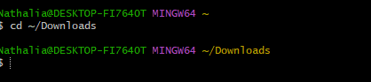
```bash
ls lab.pem monitor-php.sh
```
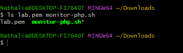

### Passo 2 — Enviar o arquivo para a VM com scp
```bash
scp -i lab.pem monitor-php.sh ubuntu@32.193.247.226:/home/ubuntu/
```
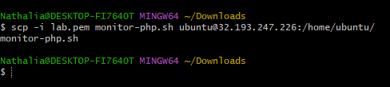

### Passo 3 — Verificar se os arquivos foram enviados corretamente
```bash
ssh -i lab.pem ubuntu@32.193.247.226
```
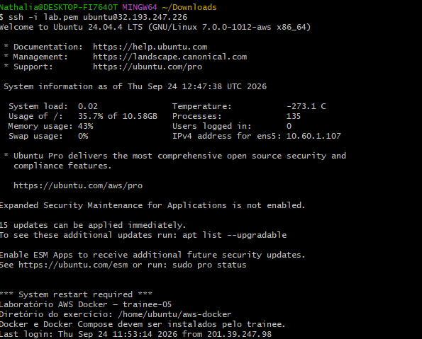
```bash
ls -la /home/ubuntu/monitor-php.sh
```
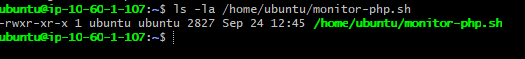

### Passo 4 — Rodar o script manualmente com tudo funcionando
Primeiro, é apresentado o comportamento "normal" (nada quebrado):
```bash
cd /home/ubuntu
./monitor-php.sh
cat monitor-php.log
```
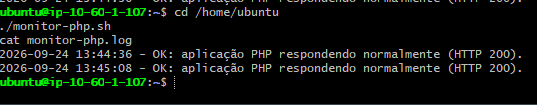

### Passo 5 — Simular uma falha de propósito
```bash
cd /home/ubuntu/aws-docker
docker compose stop backend
```
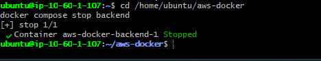

Verificar se o serviço realmente parou
```bash
docker compose ps
```
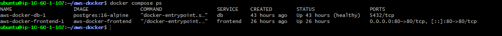

É possível verificar que o serviço backend não é exibido, então o comando deu certo

### Passo 6 — Testar o cenário de falha total (sem recuperação)

Para ver o que acontece quando o script não consegue recuperar (útil para saber se o alerta de falha crítica funciona), parar o db também, já que o backend depende dele:
```bash
docker compose stop db backend
./monitor-php.sh
cat monitor-php.log
```
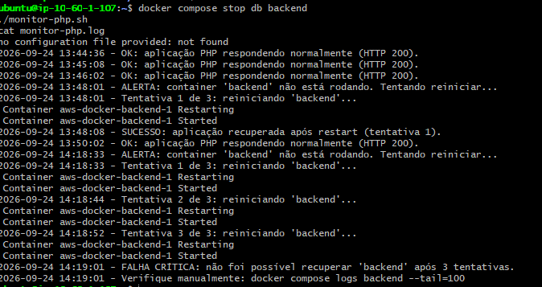

### Passo 7 — Subir tudo de volta manualmente para continuar usando o lab normalmente
```bash
cd /home/ubuntu/aws-docker
docker compose up -d
docker compose ps
```
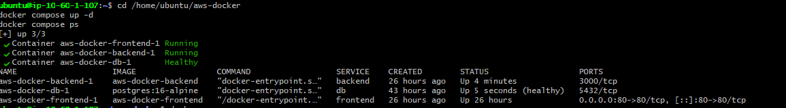

### Passo 8 — Testar a automação via cron
```bash
(crontab -l 2>/dev/null; echo "*/2 * * * * /home/ubuntu/monitor-php.sh") | crontab -
```


Derrubar o backend de novo:
```bash
cd /home/ubuntu/aws-docker
docker compose stop backend
```
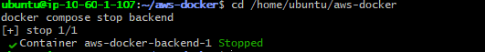

Esperar 2 minutos (sem fazer nada manualmente) e depois verificar:
```bash
docker compose ps
cat /home/ubuntu/monitor-php.log
```
Se o backend voltou sozinho e apareceu uma nova entrada no log, o cron está funcionando.

